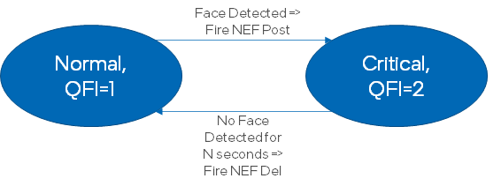

# Face Detection And Classification Sample (gst-launch command line)

This sample demonstrates face detection and classification pipeline constructed via `gst-launch-1.0` command-line utility. The sample can be run either on the same host or as client and server on two hosts.
In client and server model, if the connection is over a 5G link, it also includes a 5G AF that will dynamically provisioning the QoS driven based on the content (whether there is face detected).

## How It Works
The sample utilizes GStreamer command-line tool `gst-launch-1.0` which can build and run GStreamer pipeline described in a string format.
The string contains a list of GStreamer elements separated by exclamation mark `!`, each element may have properties specified in the format `property`=`value`.

This sample builds GStreamer pipeline of the following elements
* `filesrc` or `urisourcebin` or `v4l2src` or `udpsrc` for input from file/URL/web-camera/udp-client
* `autovideosink` or `fakesink` or `udpsink` for output the video to screen/none/udp-server
* `decodebin` for video decoding
* `videoconvert` for converting video frame into different color formats
* [gvadetect](https://dlstreamer.github.io/elements/gvadetect.html) for face detection based on OpenVINO™ Toolkit Inference Engine
* [gvaclassify](https://dlstreamer.github.io/elements/gvaclassify.html) inserted into pipeline three times for face classification on three DL models (age-gender, emotion, landmark points)
* [gvawatermark](https://dlstreamer.github.io/elements/gvawatermark.html) for bounding boxes and labels visualization
* [gvametapublish](https://dlstreamer.github.io/elements/gvametapublish.html) for meta data publishing
  - `file` or `console` or `fifo` as meta output format to file/console/fifo
* [gvafpscounter](https://dlstreamer.github.io/elements/gvafpscounter.html) for counting the FPS at the sink
* `autovideosink` for rendering output video into screen
> **NOTE**: `sync=false` property in `autovideosink` element disables real-time synchronization so pipeline runs as fast as possible

## Models

The sample uses by default the following pre-trained models from OpenVINO™ Toolkit [Open Model Zoo](https://github.com/openvinotoolkit/open_model_zoo)
*   __face-detection-adas-0001__ is primary detection network for finding faces
*   __age-gender-recognition-retail-0013__ age and gender estimation on detected faces
*   __emotions-recognition-retail-0003__ emotion estimation on detected faces
*   __landmarks-regression-retail-0009__ generates facial landmark points

> **NOTE**: Before running samples (including this one), run script `download_models.sh` once (the script located in `samples` top folder) to download all models required for this and other samples.

The sample contains `model_proc` subfolder with .json files for each model with description of model input/output formats and post-processing rules for classification models.

## Running

```sh
./face_detection_and_classification.sh [INPUT_VIDEO] [DEVICE] [SINK_ELEMENT] [OUTPUTFORMAT] [FPSCOUNTER]
```
The sample takes five command-line *optional* parameters:
1. [INPUT_VIDEO] to specify input video file.
The input could be
* local video file
* web camera device (ex. `/dev/video0`)
* RTSP camera (URL starting with `rtsp://`) or other streaming source (ex URL starting with `http://`)
* udp source (ex. `port=9001`)
If parameter is not specified, the sample by default streams video example from HTTPS link (utilizing `urisourcebin` element) so requires internet conection.
2. [DEVICE] to specify device for detection and classification.
        Please refer to OpenVINO™ toolkit documentation for supported devices.
        https://docs.openvinotoolkit.org/latest/openvino_docs_IE_DG_supported_plugins_Supported_Devices.html
        You can find what devices are supported on your system by running following OpenVINO™ toolkit sample:
        https://docs.openvinotoolkit.org/latest/openvino_inference_engine_ie_bridges_python_sample_hello_query_device_README.html
3. [SINK_ELEMENT] to choose between render mode and fps throughput mode:
    * display - render (default)
    * fps - FPS only
    * udp sink - remote udp server (for all video analytics)
4. [OUTPUTFORMAT] to choose format gvametapublish will output:
    * file - to file named output.json
    * console - to terminal console
    * fifo - to a linux fifo named output.json
5. [FPSCOUNTER] to choose whether to output FPS or not:
    * fps - count FPS and output (default)
    * nofps - do not count FPS

### Run in client/server mode

At the server:
```
$ /face_detection_and_classification.sh port=9001 CPU display-and-json fifo nofps
```

At the client to stream from USB camera:
```
$ ./face_detection_and_classification.sh /dev/video0 CPU "host=192.168.251.1 port=9001"
```

### Run the 5G/AF

If the client and server are running over a 5G network, additionally AF can be run:

```
$ go run AF.go
```

AF function usage is as below:

```
Usage of AF:
  -fifoFile string
        fifo filename (default "output.json")
  -inactiveTimer uint
        Inactive length before firing NEF delete (default 10)
  -nefJson string
        NEF post json for QoS provisioning
  -nefSvcEndpoint string
        NEF service endpoint
```

The AF logic is described as two states machine:



## Sample Output

The sample
* prints gst-launch-1.0 full command line into console
* starts the command and either visualizes video with bounding boxes around detected faces, facial landmarks points and text with classification results (age/gender, emotion) for each detected face or
prints out fps if you set SINK_ELEMENT = fps

## See also
* [Samples overview](../../README.md)
